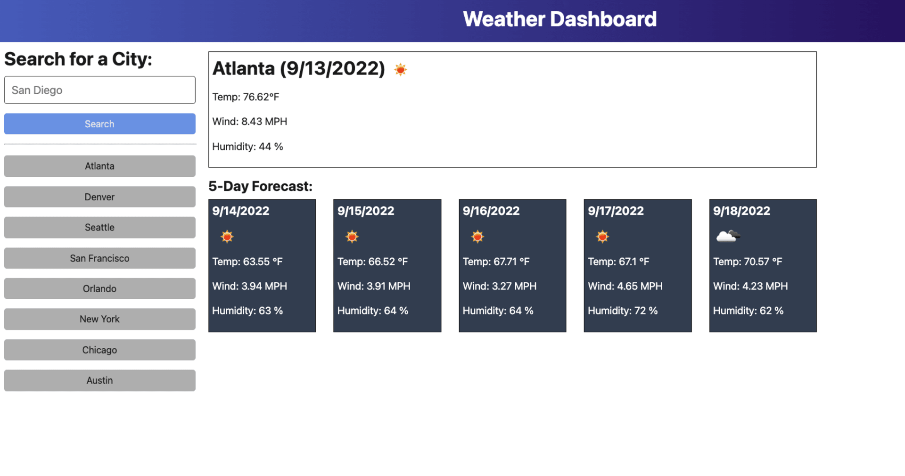
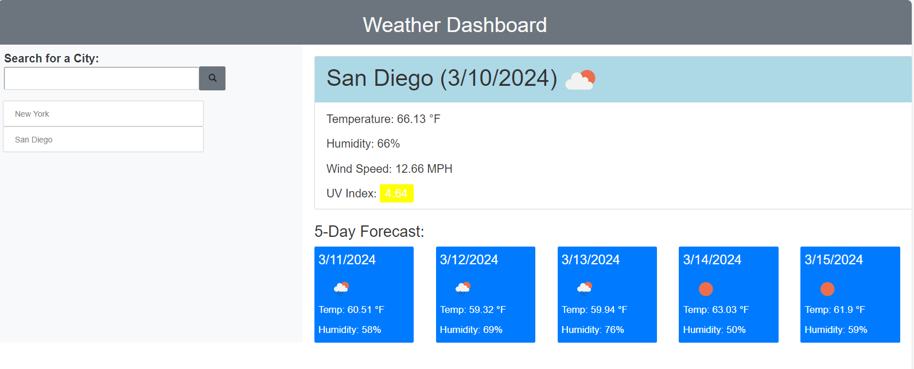

# Weather-Dashboard

## Description 
 The purpose of this assignment is to build a Weather Dashboard that will run and be updated utilizing an updated HTML, CSS and JavaScripts. 

 The Weather Dashboard should display 5 day weather forecast to retrive data for any city as well as local storage to stored and save previously 
 searched cities. 

 Example for reference: 
 

 # Results
 The expectations for this Weather Dashboard is to display 5 day weather forecast, current weather, date. 

 Take a look on the preview of final work:

 

 ## Links 

 Github Repository: https://github.com/yamilhp5/Weather-Dashboard
 
 Deployed Website: https://yamilhp5.github.io/Weather-Dashboard/

 ## Features

 HTML, Bootstrap, JQuery, CSS for the User Interface. 

 ## License 

 MIT LICENSE 
 
